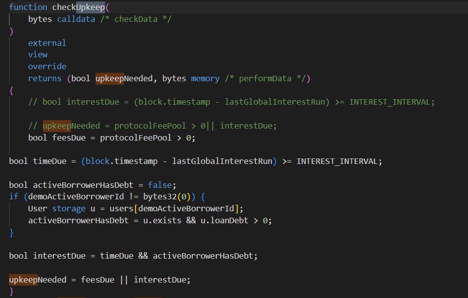
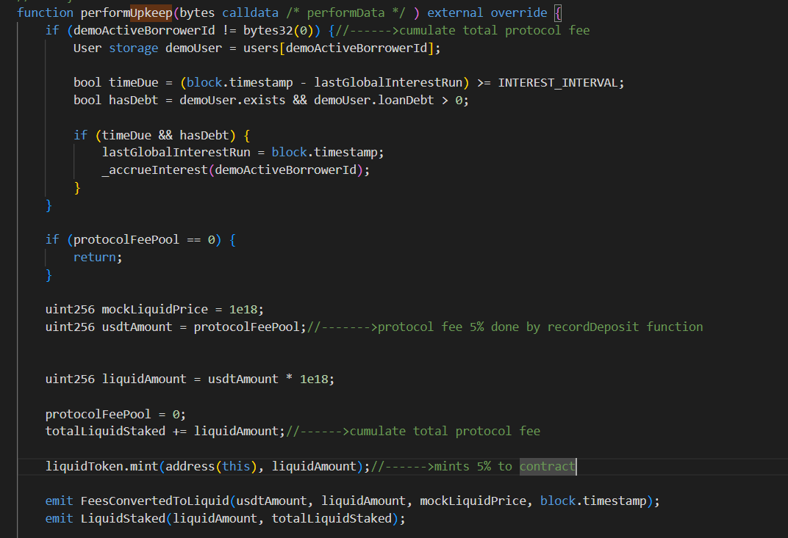
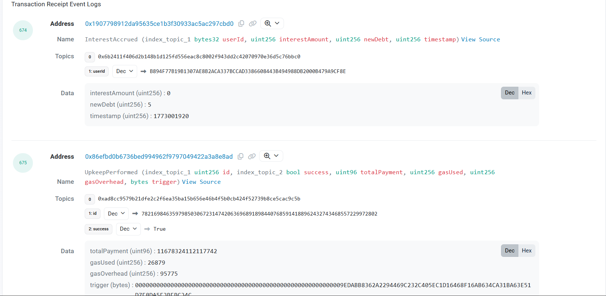
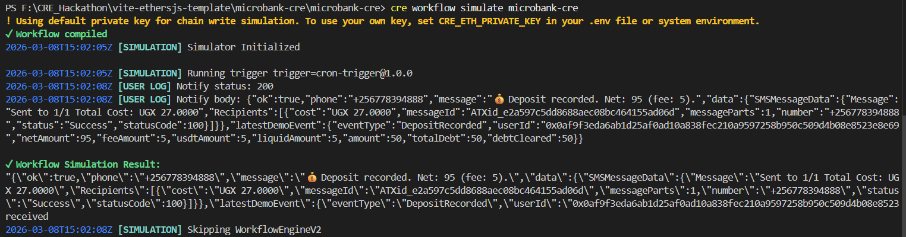
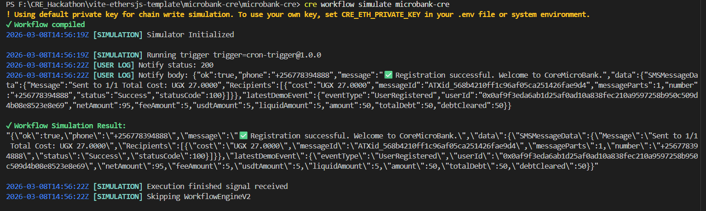
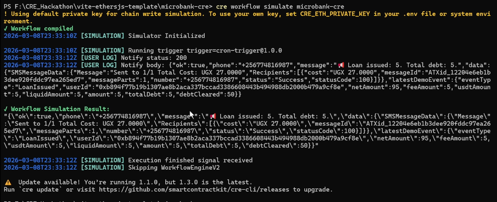

# MICRO-VOUCH AGENT

**MICRO-VOUCH AGENT — Automated microfinance protocol powered by Chainlink CRE and Automation.**
**deployed at — (https://cre-hackathon-submission.onrender.com)** 

MICRO-VOUCH AGENT demonstrates a **transparent, automated micro banking systems** using smart contracts and Chainlink automation.

The project models a **microbanking protocol** where deposits, withdraws, loans, protocol fees, and yield are managed on-chain, while real-world notifications are triggered using **Chainlink CRE workflows**.

MICRO-VOUCH AGENT Smart Contract is Deployed at contract address: 0x1907798912Da95635CE1B3F30933aC5aC297cBd0

I used a custom ERC20 token for simulating transactions deployed at 0x68eF28DFFbE618B0fA04bBBF22b34123Ab9D14b2

**CHAINLINK FILES**  
SMART CONTRACT - https://github.com/asingizwe1/CRE_Hackathon_Build/blob/main/CONTRACTS/Core_Microbanking_Features.sol
WORKFLOW - https://github.com/asingizwe1/CRE_Hackathon_Build/blob/main/microbank-cre/microbank-cre/main.ts

**Demo Video**  
[demo](https://youtu.be/hAyx6nuXqz8?si=XQWEQhE8O7nBfQVe)

The demo shows:

• User registration through an agent  
• Deposits recorded on-chain  
• Protocol fee accumulation  
• Withdrawal with protocol yield bonus  
• Chainlink Automation converting fees to yield  
• Loan issuance automated interest accrual with Chainlink Automation
• Loan repayment  
• CRE workflow simulation triggering SMS notifications

---

# Problem

Micro banking systems in many underbanked remote areas have poor internet and mobile banking and rely heavily on **manual accounting, fragmented systems, and opaque fee management**.

Common issues include:

• Manual fee handling  
• Lack of transparent accounting  
• Delayed loan interest calculations  
• No automated treasury management  
• Poor integration between financial systems and financial notifications   

Traditional infrastructure struggles to combine **automation, transparency, and event-driven communication**.

---

# Solution

MICRO-VOUCH AGENT introduces a **smart contract powered microfinance core** where financial workflows are automated.

The protocol enables:

• Agent-assisted deposits  
• Automated protocol fee collection  
• Automated yield generation from fees  
• Time-based loan interest accrual  
• Withdrawal incentives funded by protocol yield  
• Event-driven notifications using Chainlink CRE  

The result is a **fully programmable microfinance system** with transparent accounting and automated financial operations.

# Key Insight

Most blockchain applications assume users understand wallets and crypto.

However, many underbanked populations interact with financial systems through:

• agents  
• mobile money  
• SMS notifications  

This project demonstrates how smart contracts and Chainlink automation can power financial infrastructure
---

# How It Works

### System Flow

1️⃣ User registers through an agent  
2️⃣ Agent records deposit on-chain  
3️⃣ Protocol collects a **5% fee**  
4️⃣ Fees accumulate in the protocol treasury  

5️⃣ **Chainlink Automation** converts fees into yield automatically.

6️⃣ Users request loans backed by deposits.

7️⃣ Loan interest accrues automatically over time.

8️⃣ When users withdraw with no outstanding loans, they receive a **bonus from protocol yield**.

9️⃣ **Chainlink CRE workflows** trigger notifications based on protocol events.

---

# Chainlink Usage

## Chainlink Automation

Chainlink Automation monitors protocol state and executes key operations automatically:

• Fee conversion into yield  
• Periodic loan interest accrual  

This removes the need for manual protocol maintenance and ensures the system runs autonomously.

---

## Chainlink CRE (Chainlink Runtime Environment)
Chainlink CRE is used to simulate event-driven automation workflows.

## CRE WORKFLOW SIMULATION
CRE workflows trigger off-chain actions when protocol events occur, such as:

• resolving user identifiers  
• retrieving associated phone numbers  
• sending sms notifications based on financial events  

This demonstrates how **on-chain financial activity can trigger real-world communication sms systems**.

---

# Architecture
Frontend (React + Ethers)
│
│ interacts with
▼
CoreMicroBank Smart Contract deployed at 0x1907798912Da95635CE1B3F30933aC5aC297cBd0
│
├── Deposits
├── Loans
├── Interest accrual
├── Withdrawal bonuses
│
▼
Chainlink Automation
│
├── Fee conversion to yield
└── Time-based interest updates
│
▼
Chainlink CRE Workflows
│
├── Detect events
├── Resolve user phone numbers
└── Trigger notifications (SMS)

---

# Smart Contract Features

The CoreMicroBank contract implements:

### User Management
• User registration  
• Agent-assisted deposit recording  

### Protocol Accounting
• Protocol fee collection with chainlink automation 
• Yield treasury management  

### Lending
• Collateral-backed loans  
• Automated interest accrual with chainlink automation

### Withdrawals
• Withdrawal eligibility checks  
• Yield-funded incentives  

### Automation
• Automated treasury operations  
• Automated loan interest updates  

---

# Tech Stack

### Smart Contracts
• Solidity  
• Foundry  

### Chainlink
• Chainlink Automation  
• Chainlink CRE  

### Frontend
• React  
• TypeScript  
• Vite  
• Ethers.js  

### Off-chain Services
• Node.js  
• Express  
• SMS integration (Africa's Talking)

---

# Repository Structure
contracts/
CoreMicroBank.sol

frontend/
components/
hooks/
pages/

cre-workflow/
main.ts

server/
resolver-service
sms-service